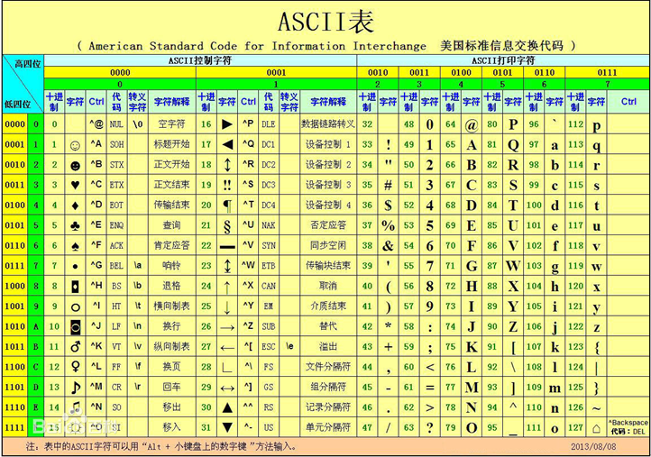
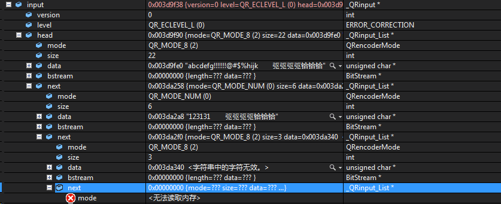
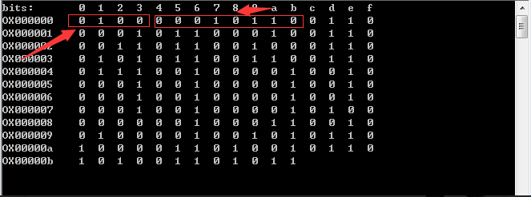
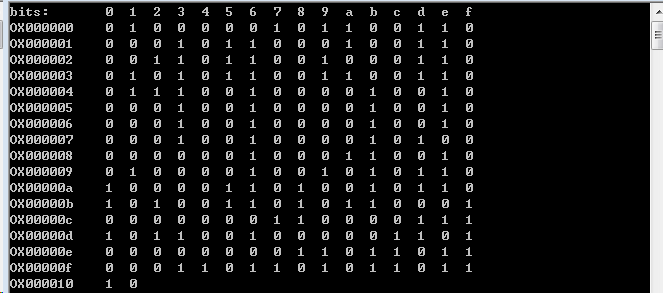
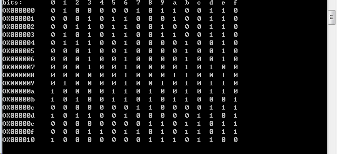

# 字符串数据编码#

## 分割字符串

### 编码模式

数据编码形式主要分为数字编码、字符编码、字节编码、日文编码（这里就不讨论日文编码了）。主要讨论的编码字符是ASCII表（摘自百度）里面的。

- 数字编码(Numeric Mode)

	数字编码的范围为 0~9。 

	对于数字编码，统计需要编码数字的个数是否为 3 的倍数：如果不是 3 的倍数，则剩下的 1 位或 2 位会被转为 4bits 或 8bits（十进制转二进制），每三位数字都会被编成 10bits, 12bits, 14bits，具体编码长度仍然需要二维码尺寸决定。

- 字符编码(Alphanumeric Mode)

	字符编码的范围有：

	数字 0~9；

	大写 A~Z（无小写）；

	几个符号$ % * + - . / 和空格。

- 字节编码(Byte Mode)

	可以是 0-255 的 ISO-8859-1 字符。有些二维码的扫描器可以自动检测是否是 UTF-8 的编码。

- 其他类型的编码本文中不详细说明

### 数据结构定义：
	
- 不同编码模式、版本下字符串数据长度计数编码成二进制位数所需位数

		// 字符指示符位数
    	static const int lengthTableBits[4][3] = {
    		{10, 12, 14},
    		{ 9, 11, 13},
    		{ 8, 16, 16},
    		{ 8, 10, 12}
    	};
	
	lengthTableBits[mode][ver]

	其中ver根据version值确定，{ver:0 version：0-9; ver:1 version:10-26; ver:2 version:27-}

	mode的值是QRencoderMode的enum值

		typedef enum {
			QR_MODE_NUL = -1,  ///< Terminator (NUL character). Internal use only
			QR_MODE_NUM = 0,   ///< Numeric mode
			QR_MODE_AN,        ///< Alphabet-numeric mode
			QR_MODE_8,         ///< 8-bit data mode
			QR_MODE_KANJI,     ///< Kanji (shift-jis) mode
			QR_MODE_STRUCTURE, ///< Internal use only
			QR_MODE_ECI,       ///< ECI mode
			QR_MODE_FNC1FIRST,  ///< FNC1, first position
			QR_MODE_FNC1SECOND, ///< FNC1, second position
		} QRencoderMode;	//typedef QRencoderMode QRencodeMode;

- ASCII表对应字符的字符索引表
 

		/******************************************************************************
		* Alphabet-numeric data table
		 *****************************************************************************/
		const signed char mQrinput::QRinput_anTable[128] = {
			-1, -1, -1, -1, -1, -1, -1, -1, -1, -1, -1, -1, -1, -1, -1, -1,
			-1, -1, -1, -1, -1, -1, -1, -1, -1, -1, -1, -1, -1, -1, -1, -1,
			36, -1, -1, -1, 37, 38, -1, -1, -1, -1, 39, 40, -1, 41, 42, 43,
			 0,  1,  2,  3,  4,  5,  6,  7,  8,  9, 44, -1, -1, -1, -1, -1,
			-1, 10, 11, 12, 13, 14, 15, 16, 17, 18, 19, 20, 21, 22, 23, 24,
			25, 26, 27, 28, 29, 30, 31, 32, 33, 34, 35, -1, -1, -1, -1, -1,
			-1, -1, -1, -1, -1, -1, -1, -1, -1, -1, -1, -1, -1, -1, -1, -1,
			-1, -1, -1, -1, -1, -1, -1, -1, -1, -1, -1, -1, -1, -1, -1, -1
		};

### 开始分割字符串：

我们现在以当初失败敲的字符串“abcdefg!!!!!!!@#$%hijk123131lmn”作为示例，后面所有的示例说明都是用这个编码字符串；

		QRencodeMode Split_identifyMode(const char *string, QRencodeMode hint)
		{
			unsigned char c, d;
			unsigned int word;
			c = string[0];
			if(c == '\0') return QR_MODE_NUL;
			if(isdigit(c)) {
				return QR_MODE_NUM;
			} else if(isalnum(c)) {
				return QR_MODE_AN;
			} else if(hint == QR_MODE_KANJI) {
				d = string[1];
				if(d != '\0') {
					word = ((unsigned int)c << 8) | d;
					if((word >= 0x8140 && word <= 0x9ffc) || (word >= 0xe040 && word <= 0xebbf)) {
						return QR_MODE_KANJI;
					}
				}
			}
			return QR_MODE_8;
		}

- isalnum（unsigned char c）宏根据前面的字符索引表判断（>=0为true）是否是分为字符类型。

- isdigit（unsigned char c）同理，但是只判断0-9；其余则为字节类型；

	在上面的代码中，首先判断是否是数字类型，因为细心点应该注意到在类型判断的范围中字符类型是包含数字类型的。

	在开始分割字符串时，首先调用Split_identifyMode(const char *string, QRencodeMode hint)判断传入字符串的首字符的编码类型。然后根据首字符的编码类型再依次扫描字符串，遇到其他的编码类型后，做相应编码长度的判断决定是否分割还是继续扫描。具体示例说明如下：

- 当首字符编码类型是字节类型：
    	
		int Split_eat8(const char *string, QRinput *input, QRencodeMode hint)		//"abcdefg!!!!!!!@#$%hijk123131lmn"
		{
			const char *p, *q;
			QRencodeMode mode;
			int ret;
			int run;
			int dif;
			int la, ln;
		
			la = mQrspec::QRspec_lengthIndicator(QR_MODE_AN, input->version);	//9
			ln = mQrspec::QRspec_lengthIndicator(QR_MODE_NUM, input->version);	//10
		
			p = string + 1;
			while(*p != '\0') {
				mode = Split_identifyMode(p, hint);
				if(mode == QR_MODE_KANJI) {
					break;
				}
				if(mode == QR_MODE_NUM) {
					q = p;
					while(isdigit(*q)) {
						q++;
					}
					dif = mQrinput::QRinput_estimateBitsMode8(p - string) /* + 4 + l8 ============x8*/
						+ mQrinput::QRinput_estimateBitsModeNum(q - p) + 4 + ln	//================
						- mQrinput::QRinput_estimateBitsMode8(q - string) /* - 4 - l8 */;
					if(dif < 0) {
						break;
					} else {
						p = q;
					}
				} else if(mode == QR_MODE_AN) {
					q = p;
					while(isalnum(*q)) {
						q++;
					}
					dif = mQrinput::QRinput_estimateBitsMode8(p - string) /* + 4 + l8 */
						+ mQrinput::QRinput_estimateBitsModeAn(q - p) + 4 + la
						- mQrinput::QRinput_estimateBitsMode8(q - string) /* - 4 - l8 */;
					if(dif < 0) {
						break;
					} else {
						p = q;
					}
				} else {
					p++;
				}
			}
			run = p - string;
			ret = mQrencode::QRinput_append(input, QR_MODE_8, run, (unsigned char *)string);
			if(ret < 0) return -1;
			return run;
		}

	当扫描到数字类型时，用另外一个指针q指向数字字符的起始位置，然后一直扫描到不是数字类型为止，开始判断是否继续使用字节模式。判断的方法是使用
	dif = mQrinput::QRinput_estimateBitsMode8(p - string)	+ mQrinput::QRinput_estimateBitsModeNum(q - p) + 4 + ln- mQrinput::QRinput_estimateBitsMode8(q - string)，预计使用字节编码与使用字节和数字两种混合编码哪种使用二进制位数更少、节约空间，即dif的正负性，QRinput_estimateBitsMode8（int n）方法是预估n个字节类型的数据会编码成多少位的二进制，QRinput_estimateBitsModeNum（int n）+ 4 + ln方法是预估n个数字类型的数据会编码成多少位的二进制，（+4+ln）是因为切换为数字编码时所需的额外信息的二进制位数。具体转换成二进制方式在后面有说明。
	当扫描到字符类型时，判断方式与遇到数字类型类似。
	最后，在字节类型扫描终止时，返回扫描到的字符个数，即将预编码的字符串的相应部分单独分割一种类型。

- 当首字符编码类型是字节类型：

		int Split_eatNum(const char *string, QRinput *input,QRencodeMode hint)
		{
			const char *p;
			int ret;
			int run;
			int dif;
			int ln;
			QRencodeMode mode;
		
			ln = mQrspec::QRspec_lengthIndicator(QR_MODE_NUM, input->version);
		
			p = string;
			while(isdigit(*p)) {
				p++;
			}
			run = p - string;
			mode = Split_identifyMode(p, hint);
			if(mode == QR_MODE_8) {
				dif = mQrinput::QRinput_estimateBitsModeNum(run) + 4 + ln
					+ mQrinput::QRinput_estimateBitsMode8(1) /* + 4 + l8 */
					- mQrinput::QRinput_estimateBitsMode8(run + 1) /* - 4 - l8 */;
				if(dif > 0) {
					return Split_eat8(string, input, hint);
				}
			}
			if(mode == QR_MODE_AN) {
				dif = mQrinput::QRinput_estimateBitsModeNum(run) + 4 + ln
					+ mQrinput::QRinput_estimateBitsModeAn(1) /* + 4 + la */
					- mQrinput::QRinput_estimateBitsModeAn(run + 1) /* - 4 - la */;
				if(dif > 0) {
					return Split_eatAn(string, input, hint);
				}
			}
			ret = mQrencode::QRinput_append(input, QR_MODE_NUM, run, (unsigned char *)string);
			if(ret < 0) return -1;
			return run;
		}

	此函数功能与字节模式一样，不同的是只遇到一个不同类型的字符和判断结果之后的行为。即如果使用数字、字节或数字、字符混合模式编码的二进制的位数分别比相应的字节或字符编码的位数多时，就分别采用后者编码方式。最终的目的也是节约编码空间，使用更少的编码位数。

- 至于字符编码就必要再赘述了。

### 示例说明

- 分割过程

	字符串“abcdefg!!!!!!!@#$%hijk123131lmn”的首字符是‘a’，Split_identifyMode得到的是QR_MODE_8即字节模式，所以调用int Split_eat8(const char *string, QRinput *input, QRencodeMode hint)函数。在这个函数里扫描到的“abcdefg!!!!!!!@#$%hijk”都是QR_MODE_8字节类型，而扫描到“123131”时，类型发生变化，一直到扫描到‘l’时终止，此时要判断使用字节编码方式是否有必要添加上“123131”这6个数字了。最终计算的dif结果是-14，因此将“123131”与前面的22字节编码的字符单独分割。
	分割之后剩下的字符串是“123131lmn”。根据首字母使用数字编码分割方式。在扫描到第一个非字母字符‘l’时，计算的dif结果是-14，所以这部分的数字就不纳入字节模式了而单独分割为一部分。
	后面的“lmn”就直接分割为一部分（当然还是要在字节编码分割函数里判断再分割）。
	最后，整个字符串分割成三部分：字节编码方式的“abcdefg!!!!!!!@#$%hijk”，数字编码的“123131”，字节编码的“lmn”。

- 分割结果

	分割后，数据以链表的形式保存，主要记录分割各部分的字符串数据、字符个数、编码模式以及下一个部分。

	

## 编码

### 重新设置编码的版本

先预估传入的版本是否可以在当前纠错等级下满足字符个数要求，然后重新设置编码的版本。

- 预估合适的版本

		int QRinput_estimateVersion(QRinput *input)
		{
			int bits;
			int version, prev;
		
			version = 0;
			do {
				prev = version;
				bits = QRinput_estimateBitStreamSize(input, prev);
				version = mQrspec::QRspec_getMinimumVersion((bits + 7) / 8, input->level);
				if (version < 0) {
					return -1;
				}
			} while (version > prev);
		
			return version;
		}

	在这个过程中，先代入当前版本，依次遍历前面所分割的字符类型链表，求出所有字符串的编码以及字符串指示编码生成的总位数，并转化成以8位为单位的字节个数，然后遍历当前纠错等级下可以容下编码数据字节个数的最小版本，然后重新代入该新版本，重复上述过程直至退出，返回预估的合适版本。

- 不同版本下最大数据量与相应的不同纠错等级下纠错码大小：

		typedef struct {
			int width; //< Edge length of the symbol
			int words;  //< Data capacity (bytes)
			int remainder; //< Remainder bit (bits)
			int ec[4];  //< Number of ECC code (bytes)
		} QRspec_Capacity;
		
		const QRspec_Capacity qrspecCapacity[QRSPEC_VERSION_MAX + 1] = {
			{  0,    0, 0, {   0,    0,    0,    0}},
			{ 21,   26, 0, {   7,   10,   13,   17}}, // 1
			{ 25,   44, 7, {  10,   16,   22,   28}},
			{ 29,   70, 7, {  15,   26,   36,   44}},
			{ 33,  100, 7, {  20,   36,   52,   64}},
			{ 37,  134, 7, {  26,   48,   72,   88}}, // 5
			{ 41,  172, 7, {  36,   64,   96,  112}},
			{ 45,  196, 0, {  40,   72,  108,  130}},
			{ 49,  242, 0, {  48,   88,  132,  156}},
			{ 53,  292, 0, {  60,  110,  160,  192}},
			{ 57,  346, 0, {  72,  130,  192,  224}}, //10
			{ 61,  404, 0, {  80,  150,  224,  264}},
			{ 65,  466, 0, {  96,  176,  260,  308}},
			{ 69,  532, 0, { 104,  198,  288,  352}},
			{ 73,  581, 3, { 120,  216,  320,  384}},
			{ 77,  655, 3, { 132,  240,  360,  432}}, //15
			{ 81,  733, 3, { 144,  280,  408,  480}},
			{ 85,  815, 3, { 168,  308,  448,  532}},
			{ 89,  901, 3, { 180,  338,  504,  588}},
			{ 93,  991, 3, { 196,  364,  546,  650}},
			{ 97, 1085, 3, { 224,  416,  600,  700}}, //20
			{101, 1156, 4, { 224,  442,  644,  750}},
			{105, 1258, 4, { 252,  476,  690,  816}},
			{109, 1364, 4, { 270,  504,  750,  900}},
			{113, 1474, 4, { 300,  560,  810,  960}},
			{117, 1588, 4, { 312,  588,  870, 1050}}, //25
			{121, 1706, 4, { 336,  644,  952, 1110}},
			{125, 1828, 4, { 360,  700, 1020, 1200}},
			{129, 1921, 3, { 390,  728, 1050, 1260}},
			{133, 2051, 3, { 420,  784, 1140, 1350}},
			{137, 2185, 3, { 450,  812, 1200, 1440}}, //30
			{141, 2323, 3, { 480,  868, 1290, 1530}},
			{145, 2465, 3, { 510,  924, 1350, 1620}},
			{149, 2611, 3, { 540,  980, 1440, 1710}},
			{153, 2761, 3, { 570, 1036, 1530, 1800}},
			{157, 2876, 0, { 570, 1064, 1590, 1890}}, //35
			{161, 3034, 0, { 600, 1120, 1680, 1980}},
			{165, 3196, 0, { 630, 1204, 1770, 2100}},
			{169, 3362, 0, { 660, 1260, 1860, 2220}},
			{173, 3532, 0, { 720, 1316, 1950, 2310}},
			{177, 3706, 0, { 750, 1372, 2040, 2430}} //40
		};

	经历上述预估过程后，字符串“abcdefg!!!!!!!@#$%hijk123131lmn”的最合适版本是2，调用int mQrencode::QRinput_setVersion(QRinput *input, int version)设置输入字符串的编码版本，因此后面将以版本2进行编码。

### 开始编码数据代码

- 不同编码类型指示

	以四位二进制表示：

	数字模式：0001
 
	字母数字模式：0010 

	8位字节模式：0100 

	KANJI模式：1000

		/**
		 * Mode indicator. See Table 2 of JIS X0510:2004, pp.16.
		 */
		#define QRSPEC_MODEID_ECI        7
		#define QRSPEC_MODEID_NUM        1
		#define QRSPEC_MODEID_AN         2
		#define QRSPEC_MODEID_8          4
		#define QRSPEC_MODEID_KANJI      8
		#define QRSPEC_MODEID_FNC1FIRST  5
		#define QRSPEC_MODEID_FNC1SECOND 9
		#define QRSPEC_MODEID_STRUCTURE  3
		#define QRSPEC_MODEID_TERMINATOR 0

- 不同编码模式、版本下字符串数据计数指示位数

	在分割字符串模块中已经介绍过，具体参考lengthTableBits数组

#### （1）8位字节模式编码

- 在编码8位字节的字符串时，先编码选择的8位字节模式，即0100；然后是字符串的个数，这部分的位数前面已说明，还是8位：00010110；最后便是字符串数据编码了，该部分很简单，直接用ASCII值表示即可，也就是22个字符的“abcdefg!!!!!!!@#$%hijk”编码成下图的二进制表示。

	

	在代码中，编码数据是存储由BitStream类型的data指针指向，因为其值由0或1构成，所以基本上在调试时不能直接看到。可以用我在MBitSteam类里面写的ShowBitStream（BitStream *bstream）方法查看。

	

	下面是第三部分字符“lmn”的数据编码：

	

#### （2）数字类型模式编码

- 同样，先编码选择的模式，四位表示0001；然后是指示编码数据位数的指示器，用10位二进制：0000000110；剩下的就是数据编码了“123131”：用“123”和“131”分隔，第一个数据是“123”，第二个数据是“131”。并且每个数据以10位长的二进制表示编码。如果当分隔数据的长度不够3位时，即为1或2时，在每种情况下使用4位长或7位长。然后将分隔的数据表示的十进制转化成二进制，结果如下图：

	

#### （3）字母数字类型模式编码

- 再这种模式下，编码类型模式指示、字符个数计数指示和前面两种模式方法一样。数据部分编码则是将分隔数据考虑为​​2个数字。第一个值增加45倍，第二个值增加到它。结果值以11位长的二进制表示法编码。当剩下的字符只有一个时，使用6位二进制编码。

	比如字符串“ABCDE123”

			"AB"	"CD"	"E1"	"23"
		45*10+11	45*12+13	45*14+1	45*2+3
		461			553			631		93
		0010	000001000	00111001101	01000101001	01001110111	00001011101

#### （4）补齐填充编码数据

编码完原始字符串及相关指示数据后，需要对这些数据进行填充：

- 如果在此版本和纠错级别中编码数据的长度已满时，不需要终结符。否则缺n位才成为8的倍数时再在结果数据最后添加n个0；

- 如果代码字数小于当前版本和纠错等级下的符号容量，则我们交替设置“11101100”和“00010001”直到满负荷运转；

	至于为什么是“11101100”和“00010001”，原因是在后面的掩码处理时，要进来避免大规模的空白或暗点模块，所以交替使用这两个数据填充。

- 最后，将所有数据每8位分隔，转化成unsigned char类型的数组。

		int QRinput_appendPaddingBit(BitStream *bstream, QRinput *input)
		{
			int bits, maxbits, words, maxwords, i, ret;
			BitStream *padding = NULL;
			unsigned char *padbuf;
			int padlen;
		
			bits = BitStream_size(bstream);
			maxwords = mQrspec::QRspec_getDataLength(input->version, input->level);
			maxbits = maxwords * 8;
		
			if(maxbits < bits) {
				errno = ERANGE;
				return -1;
			}
			if(maxbits == bits) {
				return 0;
			}
		
			if(maxbits - bits <= 4) {
				ret = mBitStream::BitStream_appendNum(bstream, maxbits - bits, 0);
				goto DONE;
			}
		
			words = (bits + 4 + 7) / 8;
		
			padding = mBitStream::BitStream_new();
			if(padding == NULL) return -1;
			ret = mBitStream::BitStream_appendNum(padding, words * 8 - bits, 0);
			if(ret < 0) goto DONE;
		
			padlen = maxwords - words;
			if(padlen > 0) {
				padbuf = (unsigned char *)malloc(padlen);
				if(padbuf == NULL) {
					ret = -1;
					goto DONE;
				}
				for(i=0; i<padlen; i++) {
					padbuf[i] = (i&1)?0x11:0xec;
				}
				ret = mBitStream::BitStream_appendBytes(padding, padlen, padbuf);
				free(padbuf);
				if(ret < 0) {
					goto DONE;
				}
			}
		
			ret = mBitStream::BitStream_append(bstream, padding);
		
		DONE:
			mBitStream::BitStream_free(padding);
			return ret;
		}

	填充之前的二进制数据如下：其中未填充前共258位，需要填充6个0才达到8的整数倍。然后在version为2、纠错等级为L（0）的情况下数据位数是34*8，所以后面需要填充一个11101100；

	

	最后，生成的272位二进制数据如下图：

	

## 前后过程链接

- 下一过程

	[计算纠错码字](./EccSpec.md)

- 总览

	[README](../README.md)

