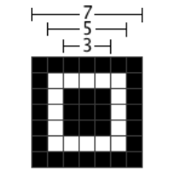
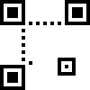
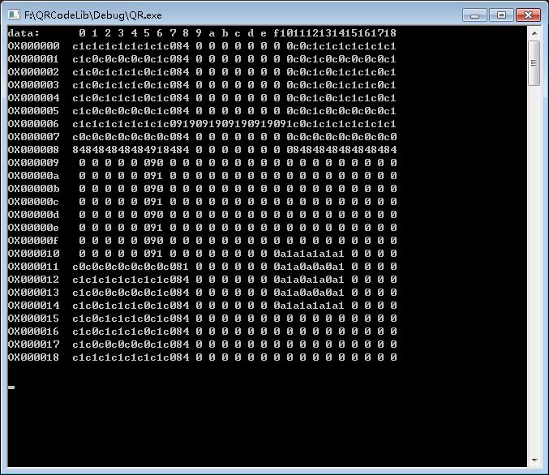

# 编码数据结构化填充#

二维码框架主要要填充下面图片上附加信息，后面会经常查看这张图片

## 创建填充二维码图片模型的框架

- 获取选择版本下二维码尺寸

	可以查询前面的数据编码qrspecCapacity数组，也可以从二维码标准里找。然后分配一个nxn大小的unsigned char *类型指针，用来存放我们以后填充的数据。指针遍历的方向是从二维码直观上的从左到右，从上到下。

	

- 填充定位图案（Position Detection Patterns）

	二维码在左上角、左下角、右上角都有一个定位图案，方便扫描时识别读取二维码数据顺序。定位图案大小是7x7的矩阵，如下图，且与生成后的图片大小没有关系，只以我们填充时的单位为准。	

	

	还有，这三个定位图案在框架中的位置是固定的。在实现中，用（0，0），（width-7, 0），（0， width-7）确定三个定位图片左上角起始点的坐标，然后黑色区域单元用0xc1填充，白色区域单元用0xc0填充，具体实现如下：

		/**
		 * @param frame	框架指针
		 * @param width	矩阵宽
		 * @param ox,oy 在框架图案上的相对起点坐标
		 */
		void putFinderPattern(unsigned char *frame, int width, int ox, int oy)
		{
			static const unsigned char finder[] = {
				0xc1, 0xc1, 0xc1, 0xc1, 0xc1, 0xc1, 0xc1,
				0xc1, 0xc0, 0xc0, 0xc0, 0xc0, 0xc0, 0xc1,
				0xc1, 0xc0, 0xc1, 0xc1, 0xc1, 0xc0, 0xc1,
				0xc1, 0xc0, 0xc1, 0xc1, 0xc1, 0xc0, 0xc1,
				0xc1, 0xc0, 0xc1, 0xc1, 0xc1, 0xc0, 0xc1,
				0xc1, 0xc0, 0xc0, 0xc0, 0xc0, 0xc0, 0xc1,
				0xc1, 0xc1, 0xc1, 0xc1, 0xc1, 0xc1, 0xc1,
			};
			int x, y;
			const unsigned char *s;
		
			frame += oy * width + ox;
			s = finder;
			for(y=0; y<7; y++) {
				for(x=0; x<7; x++) {
					frame[x] = s[x];
				}
				frame += width;
				s += 7;
			}
		}

- 填充分隔图案（Separator for Position Detection Patterns）

	很简单，填充位置可以查看该篇顶部例图，具体实现如下
		
		/* Separator for Position Detection Patterns */

		//	先考虑从上往下填充。先找到分隔图案竖条的坐标，然后一个for循环就可以了
			p = frame;
			q = frame + width * (width - 7);
			for(y=0; y<7; y++) {
				p[7] = 0xc0;
				p[width - 8] = 0xc0;
				q[7] = 0xc0;
				p += width;
				q += width;
			}
		
		//	从左往右就很简单了，因为我们的指针与框架实现是以相同方向遍历的，直接调用memset函数。
		memset(frame + width * 7, 0xc0, 8);
		memset(frame + width * 8 - 8, 0xc0, 8);
		memset(frame + width * (width - 8), 0xc0, 8);

- 填充纠错等级、掩码的格式信息（mask format information area）

	
	
	此部分到这步并未完成，先填充0x84，后面在计算掩码时再详细介绍

		memset(frame + width * 8, 0x84, 9);
		memset(frame + width * 9 - 8, 0x84, 8);
		p = frame + 8;
		for(y=0; y<8; y++) {
			*p = 0x84;
			p += width;
		}
		p = frame + width * (width - 7) + 8;
		for(y=0; y<7; y++) {
			*p = 0x84;
			p += width;
		}

- 填充时序图案（Timing pattern）

		p = frame + width * 6 + 8;
		q = frame + width * 8 + 6;
		for(x=1; x<width-15; x++) {
			*p =  0x90 | (x & 1);
			*q =  0x90 | (x & 1);
			p++;
			q += width;
		}

- 填充对齐图案 (Alignment Pattern)

	查找二维码每个版本对应的对齐标准表：

		const int alignmentPattern[QRSPEC_VERSION_MAX+1][2] = {
		{ 0,  0},
		{ 0,  0}, {18,  0}, {22,  0}, {26,  0}, {30,  0}, // 1- 5
		{34,  0}, {22, 38}, {24, 42}, {26, 46}, {28, 50}, // 6-10
		{30, 54}, {32, 58}, {34, 62}, {26, 46}, {26, 48}, //11-15
		{26, 50}, {30, 54}, {30, 56}, {30, 58}, {34, 62}, //16-20
		{28, 50}, {26, 50}, {30, 54}, {28, 54}, {32, 58}, //21-25
		{30, 58}, {34, 62}, {26, 50}, {30, 54}, {26, 52}, //26-30
		{30, 56}, {34, 60}, {30, 58}, {34, 62}, {30, 54}, //31-35
		{24, 50}, {28, 54}, {32, 58}, {26, 54}, {30, 58}, //35-40
		};

	该表中每个版本对应一个二维码数组，只包含第二个和第三个对齐图案的中心坐标，有些高版本可能有更多，但是每相邻对齐图案间距离是固定的，可以根据这个计算出来。而对齐图案和定位图案生成方法类似，只是大小和数量不一样，对齐图案的尺寸是5x5的标准。版本2下只有一个对齐图案，中心坐标是（18,18），因为（6,6）、（6,18）和（18,6）与定位图案重叠，所以不需要填充。

		void QRspec_putAlignmentPattern(int version, unsigned char *frame, int width)
		{
			int d, w, x, y, cx, cy;
		
			if(version < 2) return;
		
			d = alignmentPattern[version][1] - alignmentPattern[version][0];
			if(d < 0) {
				w = 2;
			} else {
				w = (width - alignmentPattern[version][0]) / d + 2;
			}
		
			if(w * w - 3 == 1) {
				x = alignmentPattern[version][0];
				y = alignmentPattern[version][0];
				QRspec_putAlignmentMarker(frame, width, x, y);
				return;
			}
		
			cx = alignmentPattern[version][0];
			for(x=1; x<w - 1; x++) {
				QRspec_putAlignmentMarker(frame, width,  6, cx);
				QRspec_putAlignmentMarker(frame, width, cx,  6);
				cx += d;
			}
		
			cy = alignmentPattern[version][0];
			for(y=0; y<w-1; y++) {
				cx = alignmentPattern[version][0];
				for(x=0; x<w-1; x++) {
					QRspec_putAlignmentMarker(frame, width, cx, cy);
					cx += d;
				}
				cy += d;
			}
		}

- 最后是版本信息了（Version Information）

	在版本低于7（不包含7）下，不需要填充版本信息。虽然我们例子版本为2，不需要填充，但我们还是说明一下需要填充的版本。

	版本信息的位置紧挨着左下角和右上角两个定位图案，可以参考顶部示例图片。而且其大小固定是3x6或6x3，其水平方向和竖直方向填充版本信息顺序是：

	

	在这18bits 的版本信息中，前 6bits 为版本号 (Version Number)，后 12bits 为纠错码 (BCH Bits)。高版本号的版本信息可以在下面查询。

	假设存在一个 Version 为 8 的二维码（对应 6bits 版本号为 001000），其纠错码可找到是5bc，即 10110111100； 
	则版本信息图案中的应填充的数据为：00100010110111100。之后便是按前面说的顺序依次填充。

		const unsigned int versionPattern[QRSPEC_VERSION_MAX - 6] = {
		0x07c94, 0x085bc, 0x09a99, 0x0a4d3, 0x0bbf6, 0x0c762, 0x0d847, 0x0e60d,
		0x0f928, 0x10b78, 0x1145d, 0x12a17, 0x13532, 0x149a6, 0x15683, 0x168c9,
		0x177ec, 0x18ec4, 0x191e1, 0x1afab, 0x1b08e, 0x1cc1a, 0x1d33f, 0x1ed75,
		0x1f250, 0x209d5, 0x216f0, 0x228ba, 0x2379f, 0x24b0b, 0x2542e, 0x26a64,
		0x27541, 0x28c69
		};

		if(version >= 7) {
				verinfo = mQrspec::QRspec_getVersionPattern(version);
		
				p = frame + width * (width - 11);
				v = verinfo;
				for(x=0; x<6; x++) {
					for(y=0; y<3; y++) {
						p[width * y + x] = 0x88 | (v & 1);
						v = v >> 1;
					}
				}
		
				p = frame + width - 11;
				v = verinfo;
				for(y=0; y<6; y++) {
					for(x=0; x<3; x++) {
						p[x] = 0x88 | (v & 1);
						v = v >> 1;
					}
					p += width;
				}
			}

	在填充掩码和纠错等级信息时，有一个Dark module，所以最后还要执行frame[width * (width - 8) + 8] = 0x81;

## 至此，二维码的附加信息都完工了。
	
- 到此过程，可以将以上生成的数据放到位图中，显示如下：

	

- 数据展示：

	

- 上一过程

	[计算纠错码字](./EccSpec.md)

- 下一过程

	[填充数据码和纠错码](./originaldatafill.md)

- 总览

	[README](../README.md)
