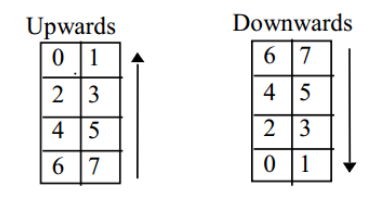
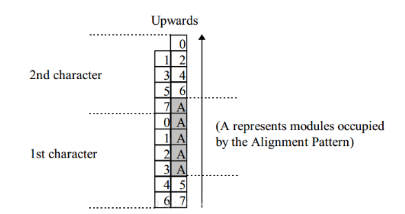
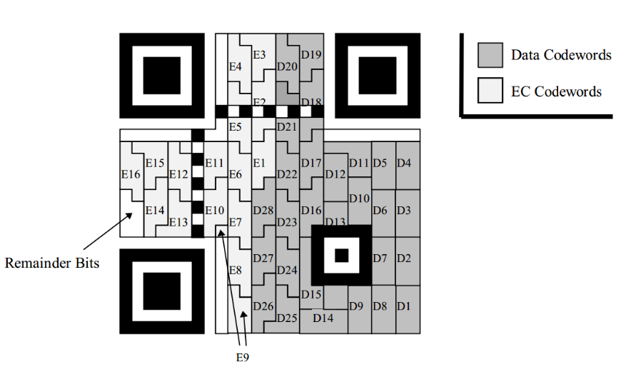
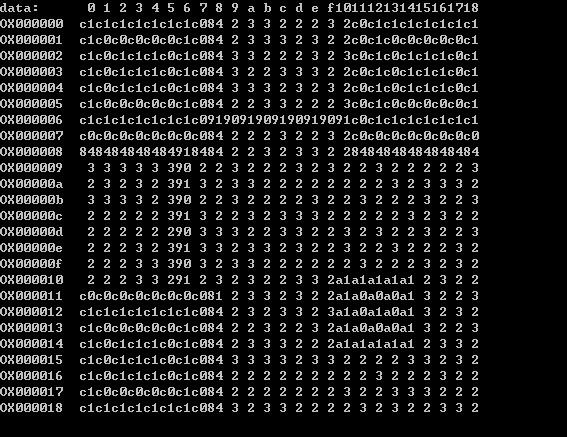

# 数据码和纠错码的填充#

## 数据码的遍历

- 在计算纠错码字中，我们得到以字节为单位的数据块和纠错块。

	在我们例子中，数据分组和分块都是1，所以只需要从数据块遍历到纠错块即可。这个遍历方式也比较无脑，下面举例说明有多个块的数据块和纠错块的遍历方式。

	假设在版本5纠错等级H的情况下，有两个数据块组和每组两个数据块，所以总共四个数据块。并且我们根据数据码计算得到纠错码，计算过程可以参考计算纠错码那篇，计算结果如下：

		数据码		
		块 1	67	85	70	134	87	38	85	194	119	50	6	18	6	103	38	 
		块 2	246	246	66	7	118	134	242	7	38	86	22	198	199	146	6	 
		块 3	182	230	247	119	50	7	118	134	87	38	82	6	134	151	50	7
		块 4	70	247	118	86	194	6	151	50	16	236	17	236	17	236	17	236

		纠错码
		块 1	213	199	11	45	115	247	241	223	229	248	154	117	154	111	86	161	111	39
		块 2	87	204	96	60	202	182	124	157	200	134	27	129	209	17	163	163	120	133
		块 3	148	116	177	212	76	133	75	242	238	76	195	230	189	10	108	240	192	141
		块 4	235	159	5	173	24	147	59	33	106	40	255	172	82	2	131	32	178	236

	然后我们的遍历顺序是先遍历数据块。如果我们把四个块数据当做一个4xn的数组，那么就从上往下、从左往右的顺序遍历，与我们常规数组遍历顺序不一样。遍历完后就开始遍历纠错码块，方式一样。

	比如上面的数据块中的遍历结果如下：

		67, 246, 182, 70, 85, 246, 230, 247, 70, 66, 247, 118, 134, 7, 119, 86, 87, 118, 50, 194, 38, 134, 7, 6, 85, 242, 118, 151, 194, 7, 134, 50, 119, 38, 87, 16, 50, 86, 38, 236, 6, 22, 82, 17, 18, 198, 6, 236, 6, 199, 134, 17, 103, 146, 151, 236, 38, 6, 50, 17, 7, 236, 213, 87, 148, 235, 199, 204, 116, 159, 11, 96, 177, 5, 45, 60, 212, 173, 115, 202, 76, 24, 247, 182, 133, 147, 241, 124, 75, 59, 223, 157, 242, 33, 229, 200, 238, 106, 248, 134, 76, 40, 154, 27, 195, 255, 117, 129, 230, 172, 154, 209, 189, 82, 111, 17, 10, 2, 86, 163, 108, 131, 161, 163, 240, 32, 111, 120, 192, 178, 39, 133, 141, 236

	遍历的实现代码

		unsigned char QRraw_getCode(QRRawCode *raw)
		{
		int col, row;
		unsigned char ret;
	
		if(raw->count < raw->dataLength) {
			row = raw->count % raw->blocks;
			col = raw->count / raw->blocks;
			if(col >= raw->rsblock[0].dataLength) {
				row += raw->b1;
			}
			ret = raw->rsblock[row].data[col];
		} else if(raw->count < raw->dataLength + raw->eccLength) {
			row = (raw->count - raw->dataLength) % raw->blocks;
			col = (raw->count - raw->dataLength) / raw->blocks;
			ret = raw->rsblock[row].ecc[col];
		} else {
			return 0;
		}
		raw->count++;
		return ret;
	}

## 数据码和纠错码在二维码框架中的遍历

### 小模块

- 模块

	小模块可以分为常规模块和非常规模块，每个模块的容量都为 8，并对应上一节的数据码和纠错码的编码字。常规情况下，小模块都为宽度为 2 的竖直小矩阵，按照不同方向将 8bits 的码字填充在内。

	比如有01234567 八个数据，在二维码框架中不同情况模块有不同的形状和模块的填充顺序，数据填充的方式也不相同。在不同的形状和模块填充顺序情况中，从0到7的填充顺序如下：

	
	
	

### 小模块填充顺序

- 我们只需要知道小模块在二维码框架中的填充顺序和形状，然后把数据按上面顺序放入小模块即完成本篇主题。

	我们将数据都分为许多小模块，然后将许多小模块串连在一起，按照方向将 8bits 的码字填充在内。

	非常规情况下，模块会产生变形。 

	填充方式如下图，图中深色区域（如 D1 区域）填充数据码，白色区域（如 E15 区域）填充纠错码。遍历顺序依旧从最右下角的 D1 区域开始，按照蛇形方向（D1→D2→…→D28→E1→E2→…→E16→剩余码）进行小模块的填充，并从右向左交替着上下移动。

	

## 具体实现

- 先遍历数据码和纠错码，前面已介绍过

- 执行p = FrameFiller_next(filler)先获取模块的位置和形状，然后按照这个当前模块的8位数据填充顺序填充数据码和纠错码位数据。

		for(i=0; i<raw->dataLength + raw->eccLength; i++) {
				code = QRraw_getCode(raw);
				bit = 0x80;
				for(j=0; j<8; j++) {
					p = FrameFiller_next(filler);
					if(p == NULL)  goto EXIT;
					*p = 0x02 | ((bit & code) != 0);
					bit = bit >> 1;
				}
			}

- 多余比特位

	直接填充0x02

		j = mQrspec::QRspec_getRemainder(version);
			for(i=0; i<j; i++) {
				p = FrameFiller_next(filler);
				if(p == NULL)  goto EXIT;
				*p = 0x02;
			}

	
## 至此，数据码和纠错码的填充完成
	
- 到此过程，可以将以上生成的数据放到位图中，显示如下：

	

	可以从右下角按小模块的读取实现读到65、102、22 ……

- 模块数据展示：

	
	
	只有进行与1操作结果为1的才在图片上显示暗点。

## 前后过程链接

- 上一过程

	[编码数据结构化填充](./DataFill.md)

- 下一过程

	[掩码处理](./Maskk.md)

- 总览

	[README](../README.md)

